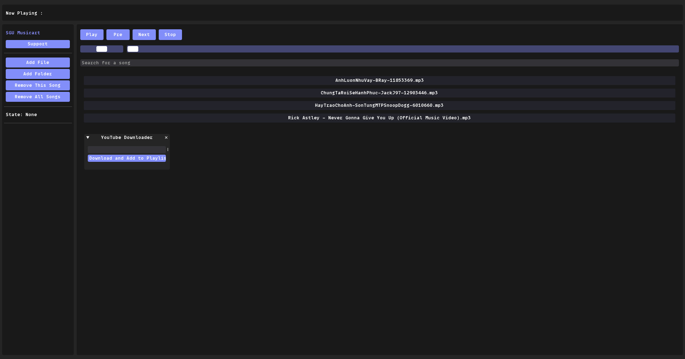

<h2 align="center">SGU Musicart</h2>
<kbd></kbd>

## Giới thiệu
- **SGU Musicart là một trình phát nhạc nhẹ được xây dựng bằng Python sử dụng [DearPyGui](https://github.com/hoffstadt/DearPyGui/) để có giao diện được thiết kế thẩm mỹ cũng như một số thư viện của bên thứ ba như:**

 
 _ Mutagen là một mô-đun Python để xử lý siêu dữ liệu âm thanh. Nó hỗ trợ các tệp âm thanh ASF, FLAC, MP4, Monkey's Audio, MP3,...

_ pygame là thư viện đa nền tảng mã nguồn mở và miễn phí để phát triển các ứng dụng đa phương tiện như trò chơi điện tử bằng Python.

_ yt-dlp là trình tải xuống âm thanh/video dòng lệnh giàu tính năng với sự hỗ trợ cho hàng nghìn trang web .

## Cài đặt
- **Tải xuống repository**
- **Cài đặt thư viện bằng pip `pip install -r requirements.txt`**
- **Chạy ứng dụng `python main.py`**

## Chức năng
- **Phát ngẫu nhiên, dừng, tạm dừng và tiếp tục bài hát.** 
- **Tiếp theo và quay lại các bài hát trước đó**
- **Điều chỉnh âm lượng**
- **Thêm file và folder bài hát để phát nhạc**
- **Tìm kiếm bài hát**
- **Tải xuống file mp3 từ đường dẫn youtube**

## Hướng dẫn sử dụng

1. Thêm, xóa bài hát khỏi danh sách phát hoặc tải bài hát từ youtube.
- **Bạn có thể nhấp vào nút "Add file" để lần lượt thêm bài hát yêu thích của bạn hoặc có thể chon "Add folder" để thêm nhiều bài hát cùng một lúc .**
- **Bạn chọn bài hát không thích trong danh sách bài hát và nhấn nút "Remove this song" để xóa bài hát đó khỏi danh sách bài hát.**
- **Bên cạnh đó có thể tải bài hát trực tiếp từ youtube bằng cách nhập url và bấm Download**
2. Phát, tạm dừng, dừng:
- **Sau khi thêm danh sách bài hát, bạn có thể nhấn nút "Play" để phát ngẫu nhiên một bài hát trong danh sách phát**
- **Bạn có thể tạm dừng một bài hát bằng cách nhấp vào nút "Pause" và tiếp tục phát bài hát đó bằng cách nhấp vào nút "Play".**
- **Bạn hoàn toàn có thể dừng bài hát bằng cách nhấn vào nút "Stop".**
3. Chuyển bài hát và điều chỉnh âm thanh:
- **Bạn có thể chuyển sang bài hát tiếp theo bằng cách nhấp vào nút "Next".**
- **Bạn có thể quay lại bài hát trước bằng cách nhấp vào nút "Pre".**
- **Bạn có thể điều chỉnh âm lượng bằng cách kéo thanh âm lượng lên hoặc xuống .**

## Thành viên nhóm
> **Thái Đình Hữu - 3120410227**

> **Dương Minh Khánh - 3120410241**

> **Lê Tuấn Hưng - 3120410221**

